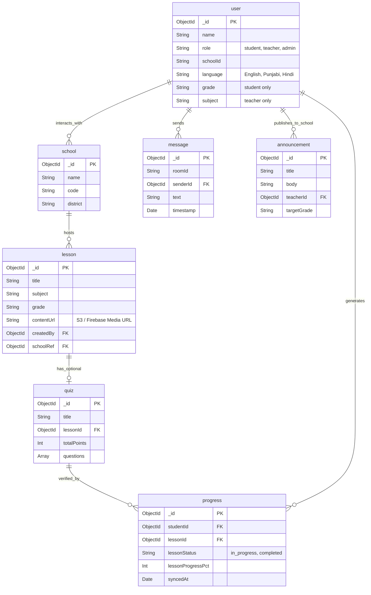

```mermaid
erDiagram
    user ||--o{ school : interacts_with
    school ||--o{ lesson : hosts
    lesson ||--o| quiz : has_optional
    quiz ||--o{ progress : verified_by
    user ||--o{ progress : generates
    user ||--o{ message : sends
    user ||--o{ announcement : publishes_to_school

    user {
        ObjectId _id PK
        String name
        String role "student, teacher, admin"
        String schoolId
        String language "English, Punjabi, Hindi"
        String grade "student only"
        String subject "teacher only"
    }

    school {
        ObjectId _id PK
        String name
        String code
        String district
    }

    lesson {
        ObjectId _id PK
        String title
        String subject
        String grade
        String contentUrl "S3 / Firebase Media URL"
        ObjectId createdBy FK
        ObjectId schoolRef FK
    }

    quiz {
        ObjectId _id PK
        String title
        ObjectId lessonId FK
        Int totalPoints
        Array questions
    }

    progress {
        ObjectId _id PK
        ObjectId studentId FK
        ObjectId lessonId FK
        String lessonStatus "in_progress, completed"
        Int lessonProgressPct
        Date syncedAt
    }

    message {
        ObjectId _id PK
        String roomId
        ObjectId senderId FK
        String text
        Date timestamp
    }

    announcement {
        ObjectId _id PK
        String title
        String body
        ObjectId teacherId FK
        String targetGrade
    }
```
