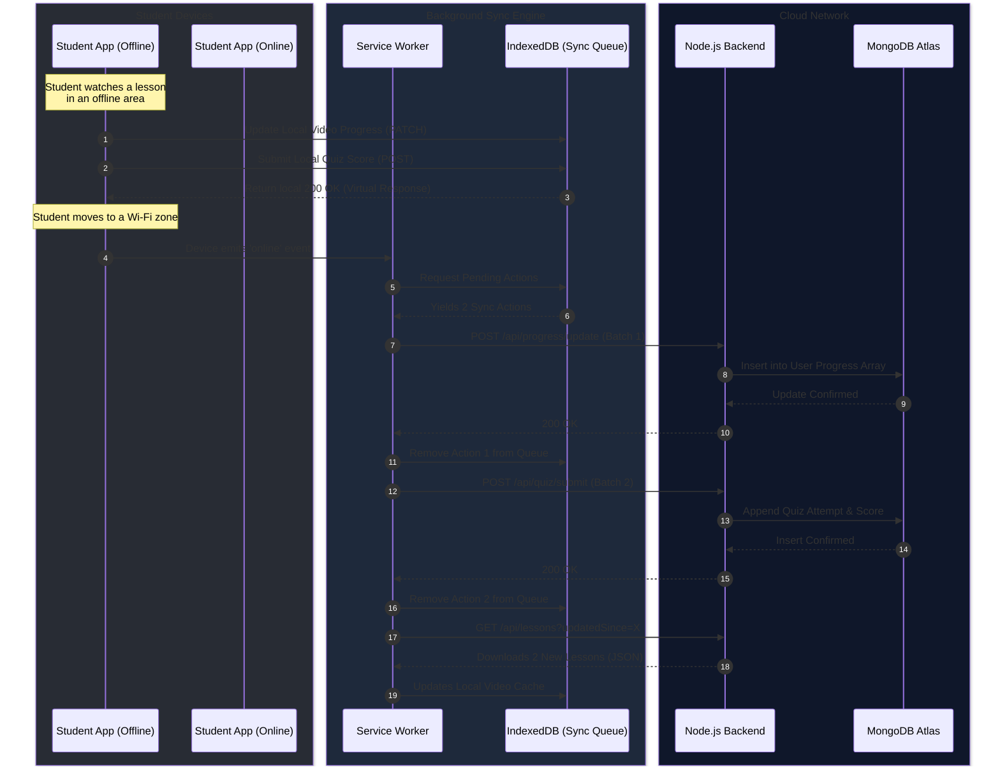

```mermaid
sequenceDiagram
    autonumber
    
    box rgb(40, 44, 52) Student Devices
    participant S1 as Student App (Offline)
    participant S2 as Student App (Online)
    end
    
    box rgb(30, 41, 59) Background Sync Engine
    participant SW as Service Worker
    participant IDB as IndexedDB (Sync Queue)
    end
    
    box rgb(15, 23, 42) Cloud Network
    participant Node as Node.js Backend
    participant Mongo as MongoDB Atlas
    end
    
    note over S1: Student watches a lesson<br/>in an offline area
    S1->>IDB: Update Local Video Progress (PATCH)
    S1->>IDB: Submit Local Quiz Score (POST)
    IDB-->>S1: Return local 200 OK (Virtual Response)
    
    note over S1: Student moves to a Wi-Fi zone
    S1->>SW: Device emits 'online' event
    SW->>IDB: Request Pending Actions
    IDB-->>SW: Yields 2 Sync Actions
    
    SW->>Node: POST /api/progress/update (Batch 1)
    Node->>Mongo: Insert into User Progress Array
    Mongo-->>Node: Update Confirmed
    Node-->>SW: 200 OK
    SW->>IDB: Remove Action 1 from Queue
    
    SW->>Node: POST /api/quiz/submit (Batch 2)
    Node->>Mongo: Append Quiz Attempt & Score
    Mongo-->>Node: Insert Confirmed
    Node-->>SW: 200 OK
    SW->>IDB: Remove Action 2 from Queue
    
    SW->>Node: GET /api/lessons?updatedSince=X
    Node-->>SW: Downloads 2 New Lessons (JSON)
    SW->>IDB: Updates Local Video Cache
```
