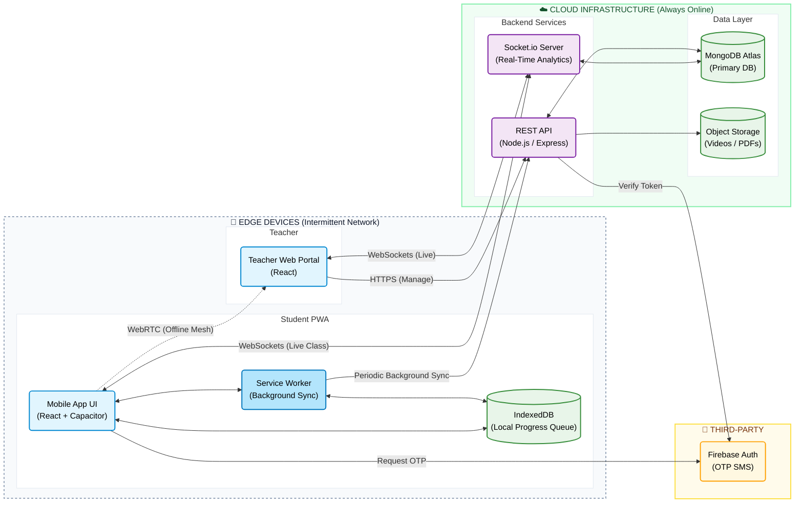

```mermaid
flowchart LR
    %% Define Clean, Light-Themed Styles for high contrast and readability
    classDef edgeApp fill:#E1F5FE,stroke:#0288D1,stroke-width:2px,color:#000
    classDef pwa fill:#B3E5FC,stroke:#0277BD,stroke-width:2px,color:#000
    classDef server fill:#F3E5F5,stroke:#7B1FA2,stroke-width:2px,color:#000
    classDef database fill:#E8F5E9,stroke:#388E3C,stroke-width:2px,color:#000
    classDef external fill:#FFF8E1,stroke:#FFA000,stroke-width:2px,color:#000

    subgraph Edge ["📱 EDGE DEVICES (Intermittent Network)"]
        direction TB
        
        subgraph TeacherLayer ["Teacher"]
            TeacherApp("Teacher Web Portal<br/>(React)"):::edgeApp
        end

        subgraph StudentLayer ["Student PWA"]
            StudentApp("Mobile App UI<br/>(React + Capacitor)"):::edgeApp
            Worker("Service Worker<br/>(Background Sync)"):::pwa
            LocalDB[("IndexedDB<br/>(Local Progress Queue)")]:::database
            
            StudentApp <--> Worker
            Worker <--> LocalDB
            StudentApp <--> LocalDB
        end
        
        StudentApp -.->|"WebRTC (Offline Mesh)"| TeacherApp
    end

    subgraph Cloud ["☁️ CLOUD INFRASTRUCTURE (Always Online)"]
        direction TB
        
        subgraph APIs ["Backend Services"]
            RestAPI("REST API<br/>(Node.js / Express)"):::server
            Socket("Socket.io Server<br/>(Real-Time Analytics)"):::server
        end
        
        subgraph Stores ["Data Layer"]
            DB[("MongoDB Atlas<br/>(Primary DB)")]:::database
            Files[("Object Storage<br/>(Videos / PDFs)")]:::database
        end
        
        RestAPI <--> DB
        Socket <--> DB
        RestAPI --> Files
    end

    subgraph Ext ["🔌 THIRD-PARTY"]
        Firebase("Firebase Auth<br/>(OTP SMS)"):::external
    end

    %% Connections: Edge to Cloud
    TeacherApp -->|"HTTPS (Manage)"| RestAPI
    TeacherApp <-->|"WebSockets (Live)"| Socket
    
    Worker -->|"Periodic Background Sync"| RestAPI
    StudentApp <-->|"WebSockets (Live Class)"| Socket
    
    %% Connections: Third-Party
    StudentApp -->|"Request OTP"| Firebase
    RestAPI -->|"Verify Token"| Firebase
    
    %% Background Colors for Subgraphs
    style Edge fill:#f8fafc,stroke:#94a3b8,stroke-width:2px,color:#0f172a,stroke-dasharray: 4 4
    style Cloud fill:#f0fdf4,stroke:#86efac,stroke-width:2px,color:#14532d
    style Ext fill:#fffbeb,stroke:#fde047,stroke-width:2px,color:#78350f
    
    style StudentLayer fill:#ffffff,stroke:#e2e8f0,stroke-width:1px
    style TeacherLayer fill:#ffffff,stroke:#e2e8f0,stroke-width:1px
    style APIs fill:#ffffff,stroke:#e2e8f0,stroke-width:1px
    style Stores fill:#ffffff,stroke:#e2e8f0,stroke-width:1px
```
