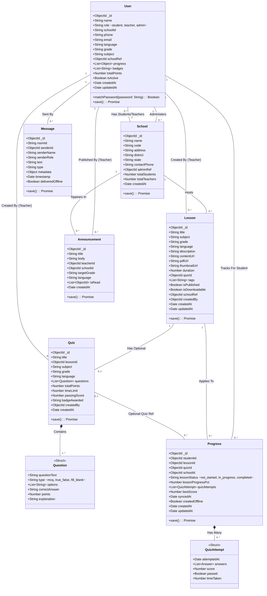

```mermaid
classDiagram
    %% Mongoose Models / Entities
    
    class User {
        +ObjectId _id
        +String name
        +String role ~student, teacher, admin~
        +String schoolId
        +String phone
        +String email
        +String language
        +String grade
        +String subject
        +ObjectId schoolRef
        +List~Object~ progress
        +List~String~ badges
        +Number totalPoints
        +Boolean isActive
        +Date createdAt
        +Date updatedAt
        +matchPassword(password: String): Boolean
        +save(): Promise
    }

    class School {
        +ObjectId _id
        +String name
        +String code
        +String address
        +String district
        +String state
        +String contactPhone
        +ObjectId adminRef
        +Number totalStudents
        +Number totalTeachers
        +Date createdAt
        +save(): Promise
    }

    class Lesson {
        +ObjectId _id
        +String title
        +String subject
        +String grade
        +String language
        +String description
        +String contentUrl
        +String pdfUrl
        +String thumbnailUrl
        +Number duration
        +ObjectId quizId
        +List~String~ tags
        +Boolean isPublished
        +Boolean isDownloadable
        +ObjectId schoolRef
        +ObjectId createdBy
        +Date createdAt
        +Date updatedAt
        +save(): Promise
    }

    class Quiz {
        +ObjectId _id
        +String title
        +ObjectId lessonId
        +String subject
        +String grade
        +String language
        +List~Question~ questions
        +Number totalPoints
        +Number timeLimit
        +Number passingScore
        +String badgeAwarded
        +ObjectId createdBy
        +Date createdAt
        +save(): Promise
    }

    class Question {
        <<Struct>>
        +String questionText
        +String type ~mcq, true_false, fill_blank~
        +List~String~ options
        +String correctAnswer
        +Number points
        +String explanation
    }

    class Progress {
        +ObjectId _id
        +ObjectId studentId
        +ObjectId lessonId
        +ObjectId quizId
        +ObjectId schoolId
        +String lessonStatus ~not_started, in_progress, completed~
        +Number lessonProgressPct
        +List~QuizAttempt~ quizAttempts
        +Number bestScore
        +Date syncedAt
        +Boolean createdOffline
        +Date createdAt
        +Date updatedAt
        +save(): Promise
    }

    class QuizAttempt {
        <<Struct>>
        +Date attemptedAt
        +List~Answer~ answers
        +Number score
        +Boolean passed
        +Number timeTaken
    }

    class Message {
        +ObjectId _id
        +String roomId
        +ObjectId senderId
        +String senderName
        +String senderRole
        +String text
        +String type
        +Object metadata
        +Date timestamp
        +Boolean deliveredOffline
        +save(): Promise
    }

    class Announcement {
        +ObjectId _id
        +String title
        +String body
        +ObjectId teacherId
        +ObjectId schoolId
        +String targetGrade
        +String language
        +List~ObjectId~ isRead
        +Date createdAt
        +save(): Promise
    }

    %% Relationships
    User "1" -- "0..*" School : Administers
    School "1" -- "0..*" User : Has Students/Teachers
    
    School "1" -- "0..*" Lesson : Hosts
    User "1" -- "0..*" Lesson : Created By (Teacher)
    
    Lesson "1" -- "0..1" Quiz : Has Optional
    User "1" -- "0..*" Quiz : Created By (Teacher)
    Quiz *-- "1..*" Question : Contains
    
    User "1" -- "0..*" Progress : Tracks For Student
    Lesson "1" -- "0..*" Progress : Applies To
    Quiz "0..1" -- "0..*" Progress : Optional Quiz Ref
    Progress *-- "0..*" QuizAttempt : Has Many
    
    User "1" -- "0..*" Message : Sent By
    
    User "1" -- "0..*" Announcement : Published By (Teacher)
    School "1" -- "0..*" Announcement : Appears In
```
